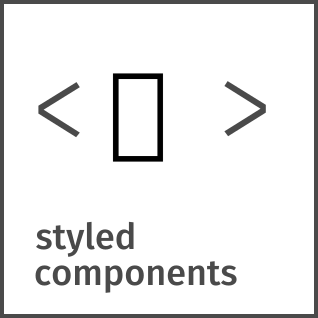

  

  

<h1 align="center">Привет &#128075; меня зовут Данила</h1>

Я занимаюсь разработкой web-страниц и приложений различной сложности. Постоянно стремлюсь расширить и углубить свои знания.

  <h3 id="header-connection" >Связаться со мной</h3>
  
  
  <!-- <a href="https://www.linkedin.com/in/danila-legkobytov/">
     -->
  </a>

---

### :left_speech_bubble: Обо мне:

- :man_technologist: Занимаюсь разработкой web-страниц и приложений различной сложности. Информацию о используемом мной стеке можно найти ниже :point_down:
- :climbing_man: Свободное время посвящаю саморазвитию - читаю документацию и различные авторские статьи по веб-разработке, изучаю новые технологии, решаю задачи на CodeWars. В общем стремлюсь превратиться в профессионала в своём деле :man_student:
<!-- - :speech_balloon: Коммуникабелен - легко нахожу язык как с коллегами так и с клиентами, так как имею богатый опыт проведения переговоров -->
- :mailbox: Для связи со мной можно использовать ссылки размещённые выше :point_up:

---

### :hammer_and_wrench: Используемый стек и инструменты:

  &nbsp
  &nbsp
  &nbsp
  &nbsp
  &nbsp
  &nbsp
  &nbsp
  &nbsp
  &nbsp
  &nbsp
  &nbsp
  &nbsp
  &nbsp
  &nbsp
  &nbsp
  &nbsp
  &nbsp
  &nbsp
  &nbsp
  &nbsp
  &nbsp
  &nbsp
  &nbsp

<!-- ---

### :fire: Моя статистика:

 -->

---

  

